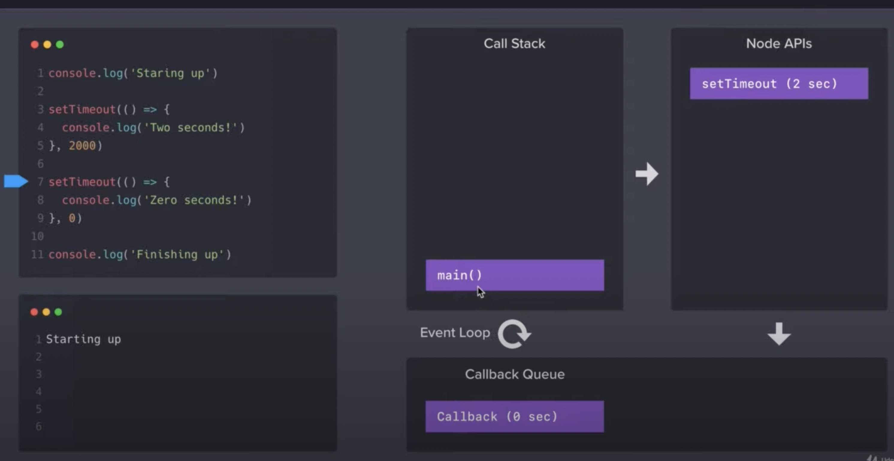

## callback function 的机制

Node.js 的运行机制：
Node.js 包含
- Call Stack 
    - 从main程序开始，所有程序都会按照stack的方式，放入call stack内，也就是先进后出原则的运行所有的程序。如果主程序内出现一个function的definition，我们会自动忽略，等到call这个function的时候，我们才会启动（发送到 Node APIs）
- Node APIs
- Event Loop

例子1:
``` javaScript
console.log('start')

// 以下的 setTimeout 都是异步程序，都会送到Node APIs中，然后移动到callback queue中
setTimeout(() => {
  console.log('setTimeout 0 ssc, test1')
}, 0)
setTimeout(() => {
  console.log('setTimeout 0 ssc, test2')
}, 0)

setTimeout(() => {
  console.log('setTimeout 2 ssc, test1')
}, 2000)

setTimeout(() => {
  console.log('setTimeout 2 ssc, test2')
}, 2000)

// 同步程序
function test() {
  console.log('the function')
}

test();
console.log('finished')
```
他的output：

start
the function
finished
setTimeout 0 ssc, test1
setTimeout 0 ssc, test2
setTimeout 2 ssc, test1
setTimeout 2 ssc, test2


例子2:
以下是一段callback function的应用

``` javaScript
console.log('start')

setTimeout(() => {
  console.log('two seconds!')
}, 2000)

setTimeout(() => {
  console.log('zero seconds!')
}, 0)

console.log('finished!')
// output:

// start
// finished
// zero seconds
// two secondes
```




https://www.youtube.com/watch?v=FVZ-A_Akros