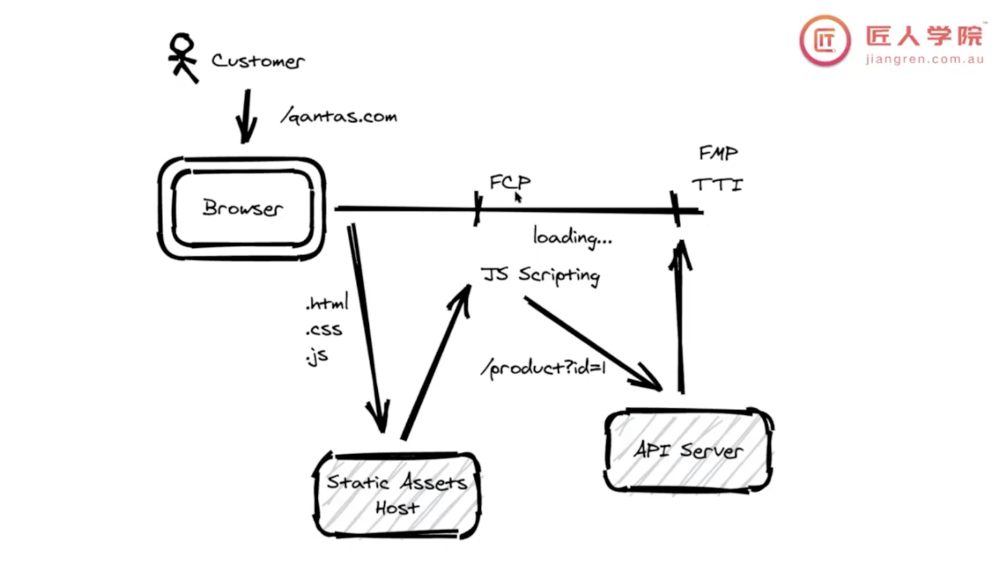

# CSR, SSR, SSG

FCP代表“首次内容绘制”（First Contentful Paint）。它是Web性能指标之一，用于衡量从用户发起导航请求到浏览器首次在屏幕上呈现任何页面内容的时间。具体来说，FCP标志着页面上的第一个元素（如文本、图像等）何时被浏览器绘制出来。

FCP是用户体验的关键指标之一，因为它反映了用户在页面加载过程中首次看到有意义内容的时间。较短的FCP通常与更好的用户体验和更高的用户满意度相关。在Web性能优化中，开发人员通常会尝试减少FCP时间，以提高页面加载速度。