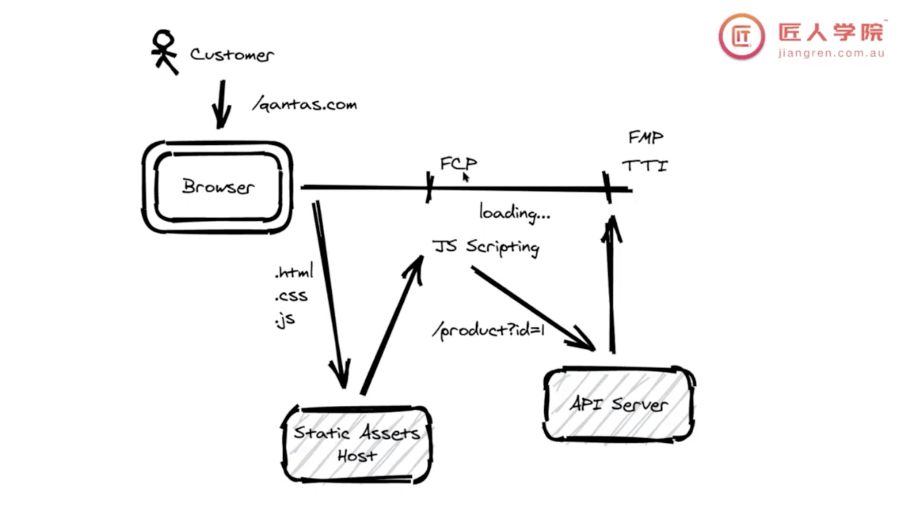
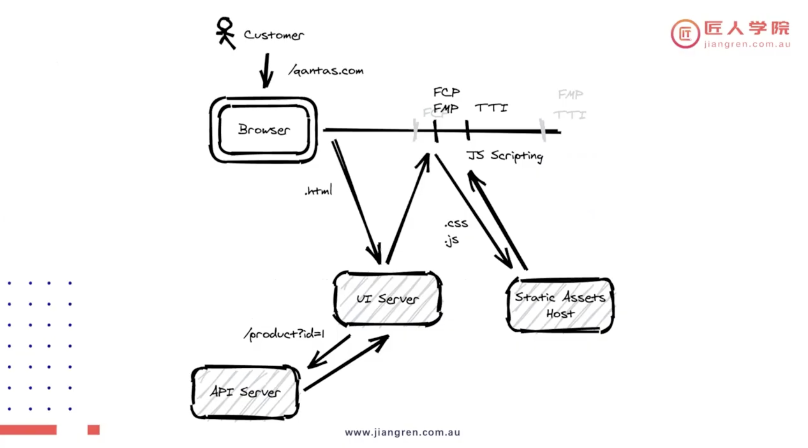
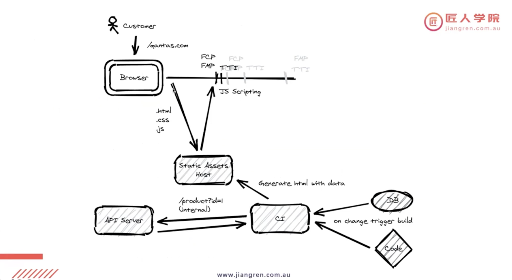
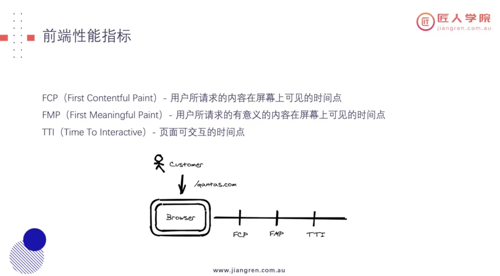

# CSR, SSR, SSG

***

CSR的痛点：

- FCP代表“首次内容绘制”（First Contentful Paint），很多时候在FCP时间点上，因为没有fetch到后端的数据，我们只能有部分页面展示，或者更现代的做法是一个loading页面。

- 所以CSR，会让SEO（类似于Google爬虫比较困惑），因为前后端分离，爬虫爬到前端内容里面不含有真的信息，只有一个template。
- 首屏性能不好： CSR初始化页面会出现白屏，因为CSR的加载一般需要3个HTTP生命周期：加载HTML -> 加载js文件 -> API请求数据-> 根据数据渲染页面

***

***

***

***