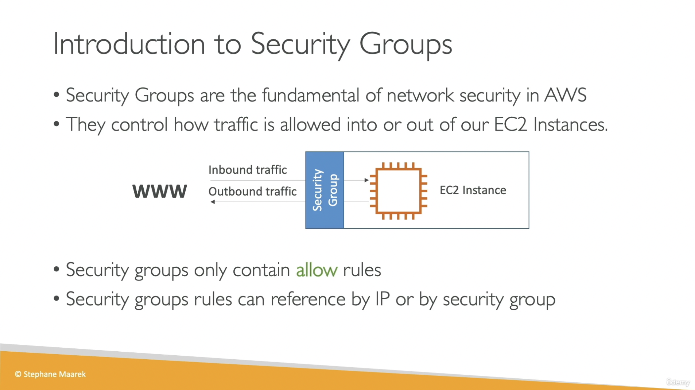
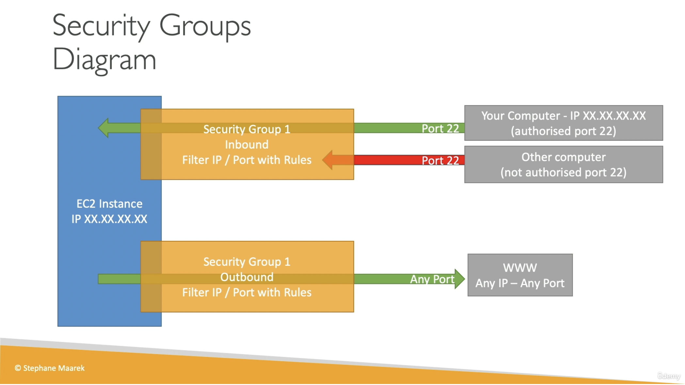
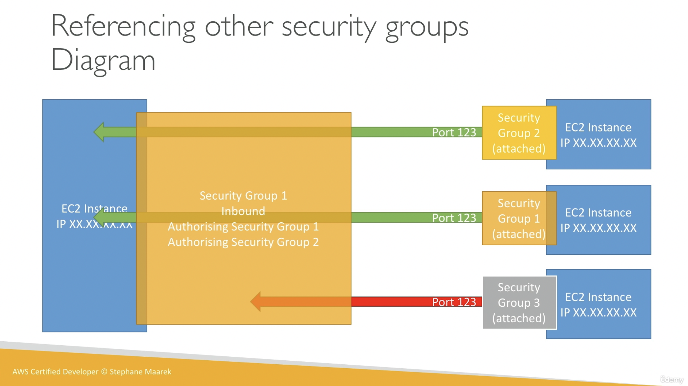

# EC2

- EC2 实际上就是在网上租一个虚拟机（有不同的类型，不同的类型有不同的 CPU，Mem，Storage，Network, firewall, roles 等）

## EC2 的运行

EC2 User Data Script: 实际上是 EC2 的启动脚本，你可以在脚本中设置很多启动选项。

- 你可以做一切你想做的事情，例如安装程序，从网上下载文件，等等。
- 当然这个启动脚本中的内容越多，你的程序启动越慢。

## EC2 的分类（Instance type）

EC2 可以根据不同的 CPU，Mem，Storage，Network, firewall, roles 等配置的不同进行分类，例如

- General Purpose: 均衡类型：相对均衡的 compute & Memory & Networking （web app 等普通应用场景）
- Compute Optimized: 计算密集型（高性能 web app，高性能计算，机器学习等）
- Memory Optinized: 记忆密集型 (常常用来做数据相关工作，数据操作，数据分析，数据可视化等)
- Storage Optimized: 数据存储密集型（数据仓库，文件分发等）

## EC2 & Security Group

- Security Group 实际上是运行在 EC2 instance 的外面的，类似于一种防火墙
- EC2 instance 和 Security Group 的关系是 many-to-many 的关系 （一个 EC2 instance 可以有多个不同的 Security Group，一个 Security Group 也可以对应多个 EC2 instance），实际上 EC2 instance 和 Security Group 都是 AWS 的资源对象，他们可以被产生出来，可以通过配置，把它们关联起来（attach），这有点像组合关系。

案例 1:
Security Group 可以根据设置拦截特定要求的请求（比如 IP，授权规则等）：

案例 2:
Security Group 可以根据设置来自其他 EC2 instance 的请求（比如一个 EC2 instance 的 Security Group 是 Security Group 1/Security Group 2，我们就允许它的请求进入，但是如果是 Security Group 3 就不让他进入）：

- 默认情况下，拦截所有 inbound traffic，允许所有 outbound traffic。

## 其他：

EC2 命名规则：

例如： m5.2xlarge

- m: instance class
- 5: generation(AWS improves them over time )
- 2xlarge: size with the instance class
