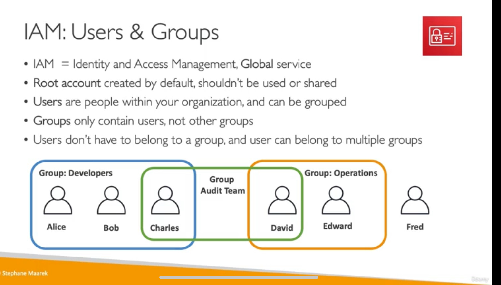
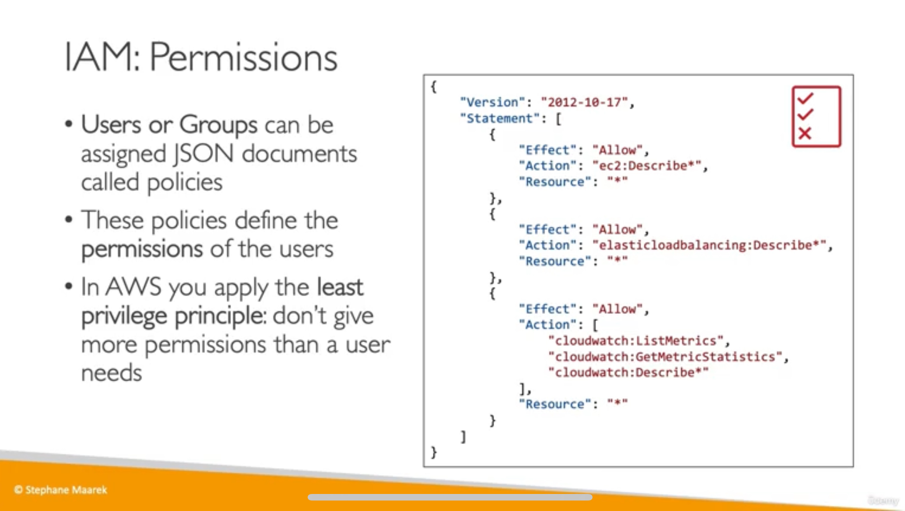

# IAM (Identity and Access Management)

### IAM Users & Groups

- 实际上你登录了 AWS，你就拥有了一个 root account，在这个 root account 内，你可以创建多个 user，你可以创建 group 然后把 user 放进去（一个 user 可以在一个组/多个组，也可以不属于任何组），可以 assign 一个 permission policy 文件（JSON 文档）给一个 group，来规定在这个 group 中的 user 就有哪些 permission。
- 在 AWS 中，一个 IAM Policy（权限策略） 可以同时附加（attach）到多个 IAM Group、IAM User 和 IAM Role，这样多个不同的身份都可以共享同一份权限规则。

常见问题：

- 在登陆的时候就可以选，是登录 root account 还事登录 IAM user account，当登录 root account 会显示 account id，当登录 IAM user 的时候除了显示它所属的 root account 的 account id 还会显示 IAM user 的 name。
  

### IAM Policies Structure

- 我们可以 assign 一个 policy 给 user 或者 group，这个 policy 可以定义这个 user 或者这个 group 的人做什么。

