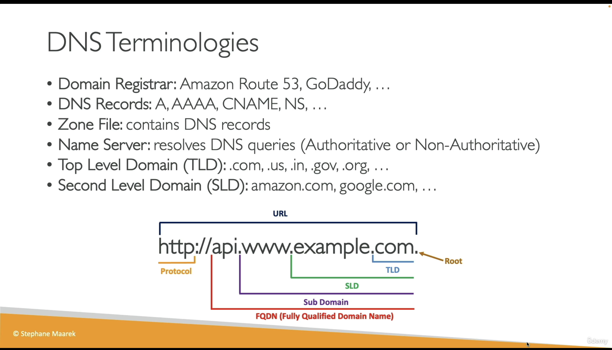
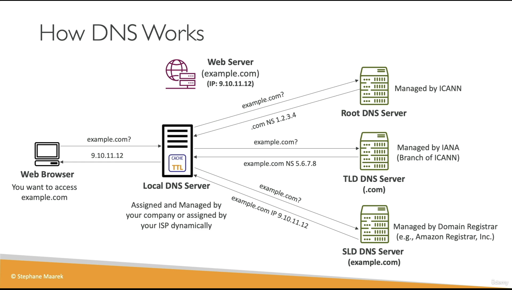
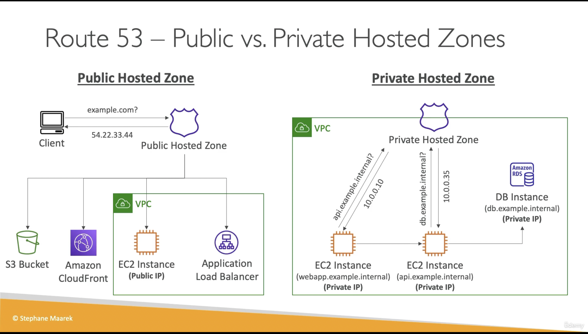

# DNS

you will find out that the final answer given by the SLD DNS Server (could be AWS Route53)

# AWS Route 53

实际上 Route53 和 CloudFront 都是全球部署的 AWS 服务，他们不需要具体的部署在某个特定的地理区域上。

举个例子：
1，S3: 例如我们如何部署一个纯粹前端的网址，我们可以把这个前端的内容 build 并且打包（一般就是 react 中的/build 文件夹），然后把它放在 S3 内，把这个 S3 放在使用这个网站最多的地理位置上。

2，CloudFront：然后我们用 CloudFront 服务指向我们的 S3 的 instance。
3，Route53: 在 Route53 上购买域名，我们在 Route53 添加一个 Alias 的 record，在这个 record 中，把这个域名解析到我们的 CloudFront 服务（实际上 3，Route53 不仅可以指向一个 IP 地址，而且可以指向一个亚马逊服务）。

这样当用户访问我们的域名的时候，就可以通过 CloudFront 访问我们的 S3 了。
