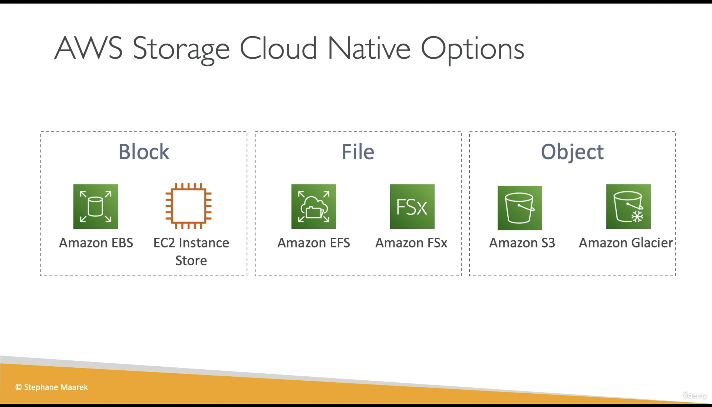
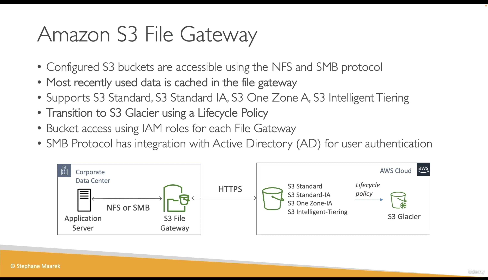
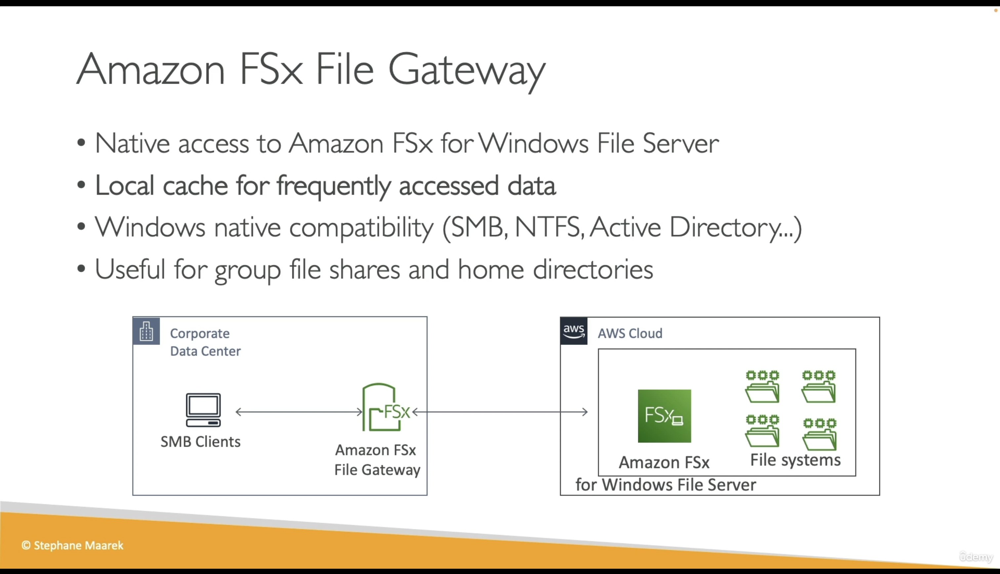
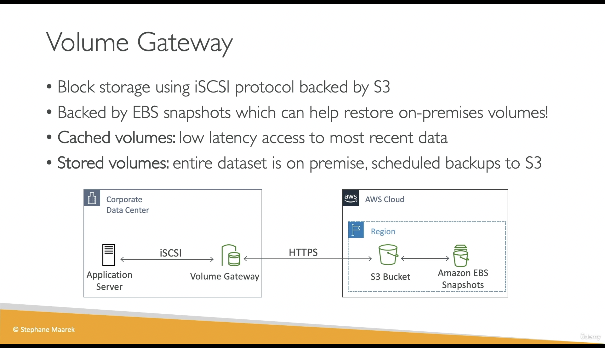
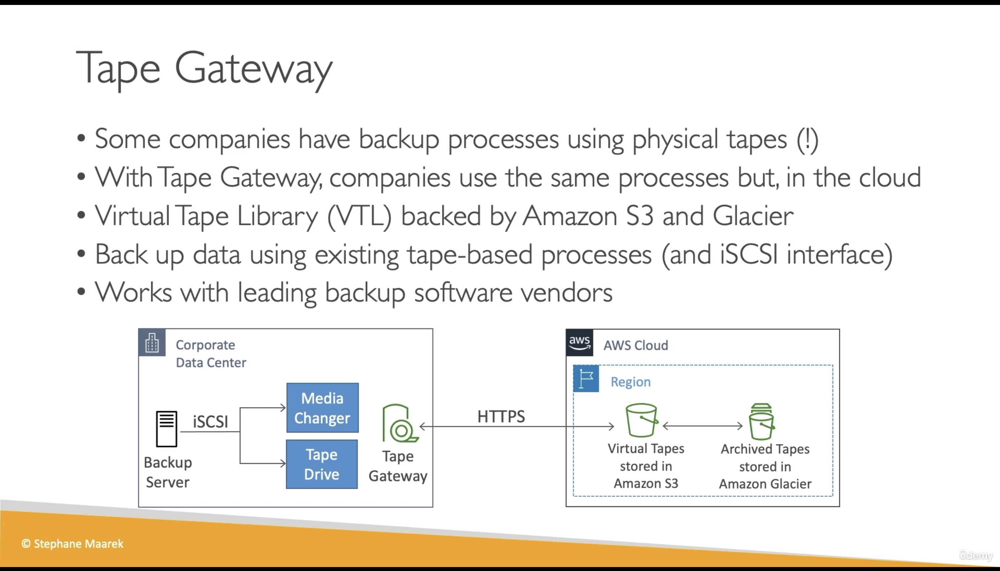
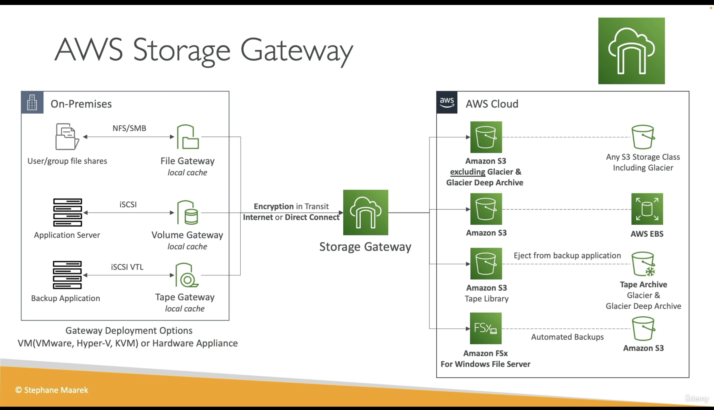

# AWS Snowball

实际上 AWS Snowball 服务主要为了解决网络传输受限的问题（包括：数据量过大，带宽比较小，有些地区信号不好或不稳定）。
例如

- 你想要上传几百 TB 的数据给你的 S3，可能要占用你的所有带宽，并且上传很多天。这时候 Snow ball 服务就很有意义了。
- 你的数据获取地在移动的卡车上，轮船上，甚至地下，网络不稳定，甚至没有网络。

snowball 主要就是给你邮寄一个硬件， 你可以直接把数据存在这个硬件上，然后邮寄给 AWS，AWS 在数据中心上传你的数据。主要的硬件类型有 2 种：

- 存储优化： 大量的内存空间，可以存储大量数据。
- 计算优化：可以在硬件上进行计算（运行 EC2 或者 lambda function），这样在获取数据的时候就可以队数据进行预处理。

具体看下面的 PPT：

# Amazon FSx

Amazon FSx 支持的主要文件系统:

1. Amazon FSx for **Windows File Server** 提供 完全托管的 Windows 文件服务器（使用 SMB 协议）。

支持 Active Directory、NTFS 权限、用户配额等。
适合：需要 Windows 文件共享、使用 .NET 应用程序、办公文档共享等。
使用场景举例：Windows 文件共享

2. Amazon FSx for **Lustre** 高性能的并行文件系统，专为 大数据处理、机器学习、高性能计算（HPC） 设计。

可以和 Amazon S3 集成，实现快速数据加载。
非常适合：高带宽、低延迟场景（如训练大型 AI 模型、科学计算等）。
使用场景举例：训练大型 AI 模型

3. Amazon FSx for **NetApp ONTAP** 提供 NetApp ONTAP 文件系统的云版本。

支持多协议（NFS、SMB、iSCSI）、数据压缩、快照和备份。
适合企业级存储需求、已有 NetApp 环境的迁移。
使用场景举例：迁移本地 NetApp 存储

4. Amazon FSx for **OpenZFS** 基于开源 ZFS 文件系统。

支持快照、压缩、复制、数据完整性校验。
适合需要高级存储管理功能的 Linux/Unix 系统。
使用场景举例：高级文件存储和快照管理

Amazon FSx 和 S3 的异同：

- Amazon FSx 不同于 S3 服务，S3 只能通过上传和下载来控制你的文件存储，但是 FSx 实际上给你提供了一个文件管理系统，可以像磁盘一样使用，支持读写、权限、目录结构。
- S3 可以使用的协议是：RESTful API（HTTP PUT/GET/DELETE），但是 Amazon FSx 可以使用的协议有很多，包括 SMB、NFS、iSCSI、Lustre（根据不同 FSx 类型）.

具体对比：

| 对比项       | **Amazon FSx**                               | **Amazon S3**                       |
| ------------ | -------------------------------------------- | ----------------------------------- |
| **类型**     | 网络文件系统（File System）                  | 对象存储（Object Storage）          |
| **典型用途** | 类似本地硬盘或共享盘，挂载给 EC2             | 存放图片、视频、备份、网站内容等    |
| **操作方式** | 像磁盘一样使用，支持读写、权限、目录结构     | 上传/下载对象，不能修改文件内部内容 |
| **性能特性** | 高吞吐、低延迟，支持缓存、本地读写           | 面向可扩展性，适合高并发访问        |
| **文件支持** | 可以直接修改文件的一部分（随机读写）         | 每次都是完整地上传/下载整个对象     |
| **支持协议** | SMB、NFS、iSCSI、Lustre（根据不同 FSx 类型） | RESTful API（HTTP PUT/GET/DELETE）  |

值得注意的是 Amazon FSx 服务是一个 region 级别的服务（类似于共享网盘），不同的 EC2 只要在同一个 region 内就可以和 FSx 产生链接。

# AWS Storage Gateway

实际上 AWS 有多种存储方式

- EBS（Elastic Block Store）块存储服务，比如 EC2，类似于传统计算机的硬盘，用来为单个 EC2 实例提供持久的存储卷
- EFS（Elastic File System）共享文件存储服务，比如 FSx，类似共享网盘，可以自动扩容缩容，让多个 EC2 进行共享（同 region）。

因为 AWS 在推动 hybird cloud（部分服务在云上- on the cloud，部分服务在本地 - on-premises），AWS Storage Gateway 就是其中的关键服务。实际上这个服务类似于 DNS 的 local DNS，可以让本地快速访问常用的在云端储存的文件。

因为 AWS 在推动 hybird cloud（部分服务在云上- on the cloud，部分服务在本地 - on-premises），AWS Storage Gateway 就是其中的关键服务。实际上这个服务类似于 DNS 的 local DNS，可以让本地快速访问常用的在云端储存的文件。
