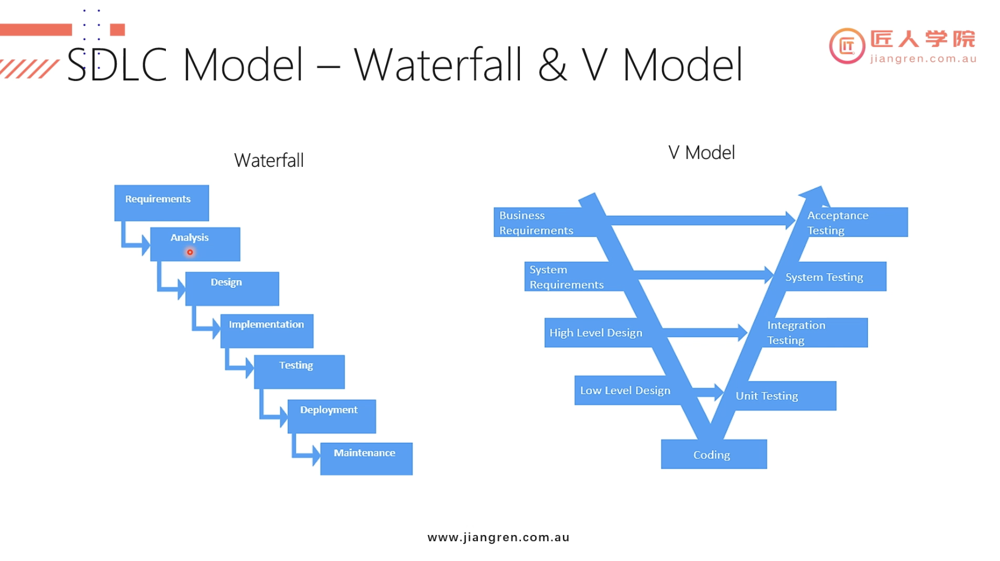
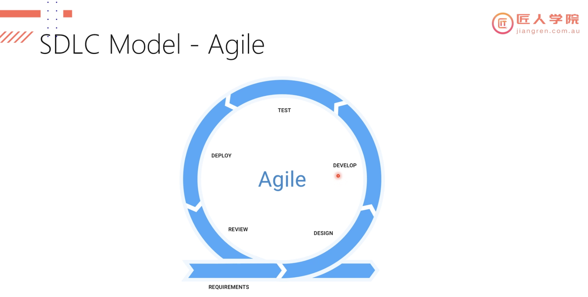

# Agile

## Software Development Life Cycle (SDLC)
- Envision (idea)
- Design (Specs & Docs)
- Build (Code Infra)
- Stabilize (Test: DAT, BAT, UAT, Defect-fix)
- Deploy
- Production (Executables: Online Services, Support Docs)
- Support (Bug-fix: Path, Updates)
- End of Life (EOL)

***

***

***

***